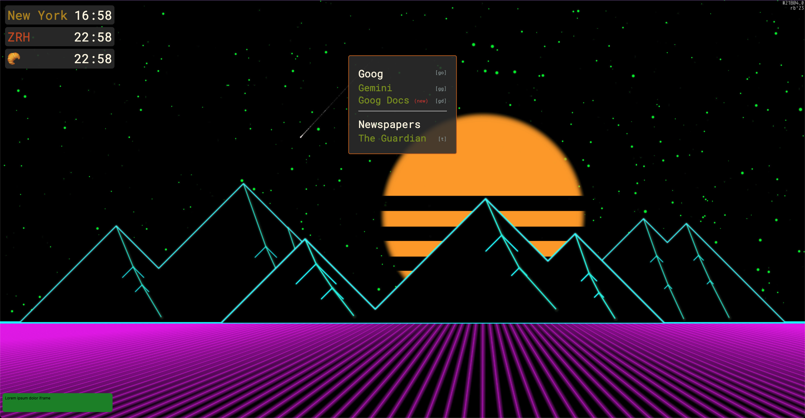

# NT (new tab)

<!-- vscode-markdown-toc -->

- [What does it do?](#Whatdoesitdo)
- [What are quicklinks?](#Whatarequicklinks)
- [Why vanilla Javascript, and why not publish it as a "real" extension?](#WhyvanillaJavascriptandwhynotpublishitasarealextension)
- [Installing](#Installing)
- [Tweaking](#Tweaking)
- [Safari?](#Safari)
- [Image credits](#Imagecredits)
- [Attribution](#Attribution)

<!-- vscode-markdown-toc-config
	numbering=false
	autoSave=true
	/vscode-markdown-toc-config -->
<!-- /vscode-markdown-toc -->

A customizable new tab extension for Chrome.

## <a name='Whatdoesitdo'></a>What does it do?

This is inspired by something I use _somewhere else_, but way easier to customize and tweak.
It lets you:

- Have large named timezones anywhere,
- Rotates backgrounds from a list on new tab,
- Add lists of iframes,
- Offers _quicklinks_,
- Can be edited and customized by changing its code (see [Tweaking](#Tweaking).

## <a name='Whatarequicklinks'></a>What are quicklinks?

In short, they are just URLs in the middle of the new tab (or anywhere you put them). But they can
have optionally shortcuts, which makes them way faster to open.

In the basic examples of the screenshot below, there are a bunch of quicklinks for Google stuff.
If you want to open Google, you can press `g` (it will highlight all links that match) and
then `o` to go to Google. To access this functionality after creating a new tab with `Cmd-Tab`
(or whatever creates a new tab in your computer), press `ESC` to switch focus to the page. So,
the flow would be `Cmd-Tab ESC g o`



Shortcuts are optional, you can find more about how to set links up in general in the `linkUtils.js` file.

Shortcuts can be more than one letter as long as they do not overlap. So, don't use `gg` for one link
and `gga` for another: `gg` will capture your keys first. If you want to have a lot of links, you can
optionally add columns, separators and tweak the font size and any other properties of the container div
without needing to modify the CSS (even if it is available to edit, it is always a hassle).

## <a name='WhyvanillaJavascriptandwhynotpublishitasarealextension'></a>Why vanilla Javascript, and why not publish it as a "real" extension?

The whole point I had in writing this was having access to everything in the extension without needing to rebuild it.
By using vanilla, run-of-the-mill JS not only I can avoid a build toolchain, but adding any new functionality is
as easy as opening any text editor and adding it to some `Utils.js` file. Changing styles? Just change `style.css`. Adding
backgrounds? Same, you get the idea.

As such, packaging this as an extension makes no sense: once packed it is _not_ customizable, it has no settings, no
background worker, no `ObjectStorage` (well, almost no storage). Configuration _is_ code. Or text, because links and tasks can be configured by writing a semi-structured form of Markdown.

## <a name='Installing'></a>Installing

- Clone or download (remember then to unzip) this repository somewhere.
- In **Chrome**, _More tools > Extensions_…
- In **Chrome > Extensions**, _Enable developer mode_.
- Click _Load unpacked_, then browse to where you downloaded the repository

When you enable it, the first time you create a new tab it will ask for confirmation that you are happy.

## <a name='Tweaking'></a>Tweaking

Just edit the source you have downloaded, and in the Chrome Extensions manager, click update (many times
this is not even needed, just a refresh or recreate the new tab).

This is thrown together in one folder on purpose, to make it easier to edit without wondering where anything
is. Everything is in this folder (except for backgrounds).

I will add some more documentation of the functions you can use at some point, but they should be pretty
descriptive.

## <a name='Safari'></a>Safari?

[Extension auto-porting](https://developer.apple.com/documentation/safariservices/converting-a-web-extension-for-safari),
as I tried for [bestBefore](https://github.com/rberenguel/bestBefore)
works, although it is not as convenient as direct-edit when using Chrome.

After cloning, run (I did it in another folder at the same level):

```
xcrun safari-web-extension-converter ../nt
```

It will automatically open the generated Xcode project: the project references the assets in the original, cloned folder:
any changes you make to the Chrome extension source can then propagate to the Safari extension by rebuilding the project
in Xcode.

You might need to set up signing (in theory for local running it is not needed), but that is free with an Apple account,
just a bit annoying to do the first time. If you don't want the iOS extension (I'm interested, but installing extensions
on iOS is annoying, and requires the 7+ GB of the iOS toolchain) remove the references to the iOS "apps" from the project
hierarchy in Xcode. Finally, [follow the instructions in the autoporting documentation](<(https://developer.apple.com/documentation/safariservices/converting-a-web-extension-for-safari)>).

To avoid creating the iOS version, run instead:

```
xcrun safari-web-extension-converter --macos-only --force PATH
```

## <a name='Imagecredits'></a>Image credits

All images are algorithmic art pieces I have created, see [mostlymaths.net/sketches](https://mostlymaths.net/sketches)

## <a name='Attribution'></a>Attribution

- Uses the [luxon.js](https://moment.github.io/luxon/#/) datetime library.
- Uses the [charts.js](https://chartsjs.org) plotting library.
- Uses the free and awesome [OpenMeteo API](https://open-meteo.com/en/docs).
- Many thanks to [Google Gemini](http://gemini.google.com") for the help.
